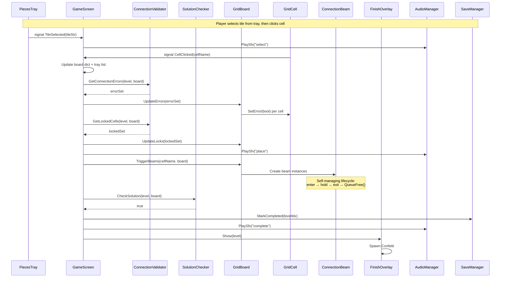

# Chromatic: Godot 4 + C# Porting Plan

## Context

Chromatic is a 1367-line React/JSX tile-placement puzzle game with 125 levels, 15 chapters, 7 tile types, multi-shelf 3D layouts, audio, animations, and save state. The goal is to port it to Godot 4 with C# for eventual Android deployment, using a code-first workflow.

The current monolithic JSX component suffers from zero separation of concerns — engine logic, rendering, state management, audio, and animations all live in one function scope. This port decomposes the game into cohesive, single-responsibility modules that are independently testable, extensible, and maintainable.

---

## Component Architecture

```mermaid
graph TB
    subgraph Autoloads["Autoload Singletons"]
        SaveManager["SaveManager<br/>─────────<br/>completedLevels: HashSet&lt;int&gt;<br/>skippedLevels: HashSet&lt;int&gt;<br/>─────────<br/>Load() / Save()<br/>IsCompleted(idx)<br/>MarkCompleted(idx)<br/>SkipLevel(idx)"]
        AudioManager["AudioManager<br/>─────────<br/>musicPlayer: AudioStreamPlayer<br/>sfxPlayer: AudioStreamPlayer<br/>tracks: TrackInfo[]<br/>currentTrack: int<br/>musicMuted / sfxMuted: bool<br/>─────────<br/>PlaySfx(name)<br/>NextTrack() / PrevTrack()<br/>ToggleMusic() / ToggleSfx()"]
    end

    subgraph Core["Core Engine (pure C#, no Godot deps)"]
        TileData["TileData<br/>─────────<br/>enum TileType<br/>enum Direction<br/>struct Connection<br/>struct TileInfo"]
        TileParser["TileParser<br/>─────────<br/>Parse(str) → TileInfo<br/>handles: NORMAL, INPUT_ONLY,<br/>OUTPUT_ONLY, PIPE, TRIGGER,<br/>STAIRS, EMPTY"]
        GridUtils["GridUtils<br/>─────────<br/>GetLayout3D(layout)<br/>FindCellPos(layout, name)<br/>GetNeighborAtDist(layout, z, r, c, dir, dist)"]
        ConnectionValidator["ConnectionValidator<br/>─────────<br/>CheckMatch(source, conn, target) → bool<br/>GetConnectionErrors(level, board) → HashSet<br/>GetLockedCells(level, board) → HashSet"]
        SolutionChecker["SolutionChecker<br/>─────────<br/>CheckSolution(level, board) → bool"]
        PipeRotation["PipeRotation<br/>─────────<br/>RotateCW(dir) → dir<br/>RotatePipe(str) → str<br/>RandomizeOrientations(pieces) → pieces"]
        ColorPalette["ColorPalette<br/>─────────<br/>Colors: Dict&lt;string, ColorInfo&gt;<br/>Dirs: Dict&lt;Direction, (dr,dc)&gt;<br/>Opposite: Dict&lt;Direction, Direction&gt;"]

        TileParser --> TileData
        TileParser --> ColorPalette
        ConnectionValidator --> TileParser
        ConnectionValidator --> GridUtils
        ConnectionValidator --> ColorPalette
        SolutionChecker --> ConnectionValidator
        SolutionChecker --> GridUtils
        PipeRotation --> ColorPalette
    end

    subgraph Data["Level Data (static C#)"]
        LevelData["LevelData<br/>─────────<br/>struct Level { number, name,<br/>cells, layout, pieces,<br/>solution, hint }"]
        LevelDatabase["LevelDatabase<br/>─────────<br/>Levels: Level[] (125 levels)"]
        ChapterData["ChapterData<br/>─────────<br/>struct Chapter { name, range,<br/>color, bgGradient, glow }<br/>Chapters: Chapter[] (15 chapters)"]
        LevelDatabase --> LevelData
    end

    subgraph Scenes["Game Scenes (Godot Nodes)"]
        Main["Main : Node<br/>─────────<br/>currentScreen: Screen<br/>─────────<br/>ShowMenu()<br/>ShowGame(levelIdx)"]

        subgraph MenuLayer["Menu Screen"]
            MenuScreen["MenuScreen : Control<br/>─────────<br/>currentChapterIdx: int<br/>─────────<br/>PopulateChapter()<br/>OnLevelSelected(idx)"]
        end

        subgraph GameLayer["Game Screen"]
            GameScreen["GameScreen : Control<br/>─────────<br/>currentLevel: Level<br/>board: Dict&lt;string, string&gt;<br/>tray: List&lt;string&gt;<br/>selectedTile: string?<br/>solved: bool<br/>─────────<br/>InitLevel(idx)<br/>HandleCellClick(cell)<br/>HandleTrayClick(tile)<br/>ClearBoard()<br/>SkipLevel()"]
            GridBoard["GridBoard : Control<br/>─────────<br/>cells: Dict&lt;string, GridCell&gt;<br/>currentShelf: int<br/>cellSize: int<br/>─────────<br/>BuildGrid(level)<br/>SetShelf(z)<br/>ComputeCellSize(layout)"]
            GridCell["GridCell : Control<br/>─────────<br/>cellName: string<br/>state: CellState<br/>─────────<br/>SetTile(TilePiece?)<br/>SetError(bool)<br/>SetLocked(bool)<br/>SetTarget(bool)"]
            TilePiece["TilePiece : Control<br/>─────────<br/>tileStr: string<br/>tileInfo: TileInfo<br/>─────────<br/>_Draw() override<br/>DrawNormal()<br/>DrawInputOnly()<br/>DrawOutputOnly()<br/>DrawPipe()<br/>DrawTrigger()<br/>DrawStairs()"]
            PiecesTray["PiecesTray : HBoxContainer<br/>─────────<br/>pieces: List&lt;TilePiece&gt;<br/>─────────<br/>SetPieces(List&lt;string&gt;)<br/>RemovePiece(str)<br/>AddPiece(str)"]
            HUD["HUD : HBoxContainer<br/>─────────<br/>OnBackPressed()<br/>OnHintToggled()<br/>OnClearPressed()<br/>OnSkipPressed()"]
            ConnectionBeam["ConnectionBeam : Node2D<br/>─────────<br/>start / end: Vector2<br/>srcColor / tgtColor: Color<br/>phase: BeamPhase<br/>─────────<br/>_Draw() override<br/>Animate()"]
        end

        subgraph UILayer["UI Overlays"]
            FinishOverlay["FinishOverlay : Control<br/>─────────<br/>OnNext() / OnReplay()"]
            VictoryScreen["VictoryScreen : Control<br/>─────────<br/>OnBackToMenu()"]
            Confetti["Confetti : GPUParticles2D"]
            HintBar["HintBar : PanelContainer<br/>─────────<br/>SetHint(text)<br/>Show() / Hide()"]
            ShelfSwitcher["ShelfSwitcher : HBoxContainer<br/>─────────<br/>OnShelfUp() / OnShelfDown()"]
        end
    end

    %% Cross-layer dependencies
    Main --> MenuScreen
    Main --> GameScreen
    Main --> SaveManager

    MenuScreen --> ChapterData
    MenuScreen --> LevelDatabase
    MenuScreen --> SaveManager
    MenuScreen --> AudioManager

    GameScreen --> GridBoard
    GameScreen --> PiecesTray
    GameScreen --> HUD
    GameScreen --> ConnectionValidator
    GameScreen --> SolutionChecker
    GameScreen --> PipeRotation
    GameScreen --> SaveManager
    GameScreen --> AudioManager
    GameScreen --> LevelDatabase

    GridBoard --> GridCell
    GridBoard --> ConnectionBeam
    GridBoard --> GridUtils
    GridCell --> TilePiece
    PiecesTray --> TilePiece
    TilePiece --> TileParser
    TilePiece --> ColorPalette

    GameScreen --> FinishOverlay
    GameScreen --> VictoryScreen
    GameScreen --> HintBar
    GridBoard --> ShelfSwitcher
    FinishOverlay --> Confetti
    VictoryScreen --> Confetti
```



### Signal Flow (event-driven decoupling)



---

## Design Principles Applied

### Single Responsibility
Each class owns exactly one concern. The JSX monolith's `handleCellClick` (lines 1015-1043) currently mixes input handling, state mutation, validation, animation, and win detection in one function. In the port, `GameScreen.HandleCellClick()` orchestrates by delegating:

- Board state update → local dict manipulation
- Validation → `ConnectionValidator.GetConnectionErrors()`
- Lock state → `ConnectionValidator.GetLockedCells()`
- Win check → `SolutionChecker.CheckSolution()`
- Visuals → signals that `GridBoard`, `ConnectionBeam`, and `AudioManager` react to independently

### High Cohesion
Related logic lives together instead of being scattered:
- All tile parsing (7 formats) → `TileParser` (currently JSX lines 51-111)
- All spatial queries → `GridUtils` (currently lines 113-143)
- All pipe manipulation → `PipeRotation` (currently lines 216-253, wedged between validation and level data)
- All save/load → `SaveManager` (currently 6 separate `useState`/`useEffect`/`localStorage` blocks spread across lines 796-836)

### Loose Coupling via Signals
Godot signals replace the JSX pattern of direct function calls + `setTimeout` chains:
- `GameScreen` emits `TilePlaced(cellName)` — it doesn't know beams or flash animations exist
- `GridBoard` listens and spawns `ConnectionBeam` instances that self-destruct after their animation
- This replaces the tightly-coupled `triggerLinkAnimation()` (lines 907-1013) which directly creates beam objects, manages phase transitions via 3 nested `setTimeout`s, and manipulates flash state

### Open/Closed — Extensibility
Adding a new tile type (as was done for TRIGGER and STAIRS) requires:

| Step | JSX (current) | Godot C# (port) |
|---|---|---|
| Parse format | Edit `parseTile()` in monolith | Add case in `TileParser.Parse()` |
| Match rules | Edit `checkMatch()` in monolith | Add case in `ConnectionValidator.CheckMatch()` |
| Rendering | Edit `TilePiece` component in monolith | Add `DrawNewType()` method in `TilePiece.cs` |
| Risk | All in one file — any edit can break anything | Separate files — changes are isolated |

### Testability
The `Core/` layer has zero Godot dependencies — pure C# that can be unit tested:
- Parse every tile format string and assert correct `TileInfo` output
- Run all 125 level solutions through `SolutionChecker` as a regression suite
- Test `ConnectionValidator` with crafted invalid board states
- Test `PipeRotation` for all 4 orientations
- None of this requires launching the game engine

### State Ownership
State lives where it belongs instead of 20+ hooks in one function:

| State | JSX Location | C# Owner |
|---|---|---|
| board, tray, selectedTile, solved | `ChromaticPuzzle` hooks | `GameScreen` |
| currentShelf, cellSize | `ChromaticPuzzle` hooks | `GridBoard` |
| completedLevels, skippedLevels | `ChromaticPuzzle` hooks + localStorage | `SaveManager` (autoload) |
| currentTrack, musicMuted, sfxMuted | `ChromaticPuzzle` hooks | `AudioManager` (autoload) |
| activeBeams, flashes | `ChromaticPuzzle` hooks | `GridBoard` + `ConnectionBeam` (self-owned) |
| showHint, currentChapterIndex | `ChromaticPuzzle` hooks | `HintBar` / `MenuScreen` |

---

## Project Structure

```
chromatic-godot/
  project.godot

  # ── Core Engine (pure C#, no Godot deps) ──
  src/
    Core/
      TileData.cs            # TileType enum, Direction enum, Connection struct, TileInfo struct
      TileParser.cs          # Parse(str) → TileInfo for all 7 tile formats
      GridUtils.cs           # GetLayout3D, FindCellPos, GetNeighborAtDist
      ConnectionValidator.cs # CheckMatch, GetConnectionErrors, GetLockedCells
      SolutionChecker.cs     # CheckSolution (delegates to validator)
      ColorPalette.cs        # Color dict, direction vectors, opposite map
      PipeRotation.cs        # RotateCW, RotatePipe, RandomizeOrientations

  # ── Level Data (static C#) ──
    Data/
      LevelData.cs           # Level struct
      LevelDatabase.cs       # 125 levels as static array
      ChapterData.cs         # 15 chapters as static array

  # ── Scenes & Scripts ──
    Scenes/
      Main.tscn / Main.cs
      Menu/
        MenuScreen.tscn / MenuScreen.cs
      Game/
        GameScreen.tscn / GameScreen.cs
        GridBoard.tscn / GridBoard.cs
        GridCell.tscn / GridCell.cs
        TilePiece.tscn / TilePiece.cs
        PiecesTray.tscn / PiecesTray.cs
        ConnectionBeam.cs
      UI/
        FinishOverlay.tscn / FinishOverlay.cs
        VictoryScreen.tscn / VictoryScreen.cs
        Confetti.cs
        HintBar.tscn / HintBar.cs
        ShelfSwitcher.tscn / ShelfSwitcher.cs

  # ── Autoloads ──
    Autoloads/
      SaveManager.cs
      AudioManager.cs

  # ── Resources ──
    Resources/
      Fonts/  (Orbitron, JetBrains Mono)
      Themes/ (dark_theme.tres)
      Shaders/ (shimmer, tile_glow, energy_beam .gdshader)

  # ── Audio ──
    Audio/
      Music/  (14 .wav tracks)
      SFX/    (select, place, remove, complete .wav)
```

---

## Porting Phases

### Phase 1: Core Engine
Direct 1:1 translation of pure logic — no Godot dependency.

| JSX Source (lines) | C# Target | Functions |
|---|---|---|
| 5-14, 38-49 | `ColorPalette.cs` | Colors, direction vectors, opposites |
| 51-111 | `TileParser.cs` | Parse all 7 tile formats |
| 113-143 | `GridUtils.cs` | 3D layout, cell position, neighbor lookup |
| 16-36, 145-204 | `ConnectionValidator.cs` | CheckMatch, errors, locks |
| 255-282 | `SolutionChecker.cs` | Full board validation |
| 216-253 | `PipeRotation.cs` | Rotation + randomization |
| 285-411 | `LevelDatabase.cs` | 125 level definitions |
| 423-439 | `ChapterData.cs` | 15 chapter definitions |

### Phase 2: Scene Architecture + Tile Rendering
Build Godot scene tree. Implement `TilePiece._Draw()` for all 7 tile types. Build `GridBoard` with dynamic cell sizing and multi-shelf fan layout.

### Phase 3: Interaction System
Click-to-select/place/swap/return flow. Pipe rotation. Locked cell prevention. Error shake animation. All via Godot signals.

### Phase 4: Game Flow + UI
Screen management (Main → Menu ↔ Game). Chapter navigation. Level list with completion state. HUD controls. Finish/Victory overlays. Save/load via `SaveManager`.

### Phase 5: Visual Polish
Connection beams (Line2D + shader). Confetti (GPUParticles2D). Tween animations (float, shake, pulse, fade). Shimmer/glint shaders. Chapter gradient backgrounds.

### Phase 6: Audio
`AudioManager` autoload with 14-track playlist, SFX, mute toggles, auto-advance.

### Phase 7: Android Deployment
Touch input (native in Godot). Stretch mode `canvas_items` / aspect `expand`. Export preset with signing.

---

## Key Architectural Decisions

1. **Single Main scene** with child screens toggled by visibility — avoids reload overhead, matches React pattern
2. **Custom `_Draw()`** on TilePiece/GridCell/ConnectionBeam — better performance than sprite composition for 18+ tiles
3. **Static C# level data** — type-safe, no JSON parsing, preserves the `"RED|BLUE:RIGHT"` string format
4. **`_GuiInput` click handling** — no drag-and-drop, matches the select-then-place interaction model
5. **Autoload singletons** for SaveManager and AudioManager — cross-scene persistence without prop drilling
6. **Minimal shaders** — shimmer, glow, beams only; most drawing via Godot's canvas API

---

## Verification Plan

1. **Engine unit tests:** Parse all 7 tile formats, validate all 125 level solutions, test error detection with invalid boards
2. **Visual comparison:** Side-by-side with React prototype for tile rendering fidelity
3. **Mechanic playthrough:** Levels 1, 30, 60, 88, 108, 115, 125 (one per mechanic group)
4. **Signal verification:** Confirm beam/confetti/sound fire correctly on place/solve events
5. **Save persistence:** Quit and relaunch, verify completed/skipped state preserved
6. **Android deploy:** Emulator test for touch input and screen scaling
